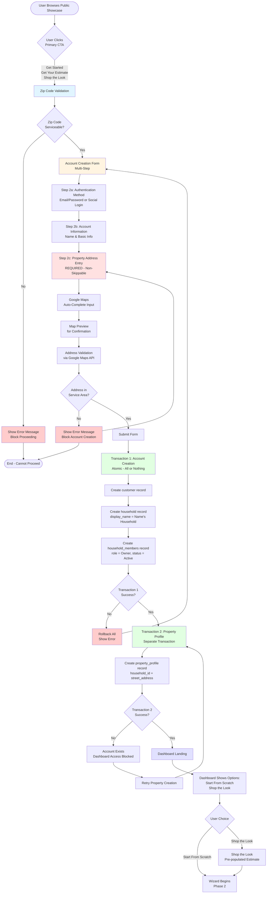
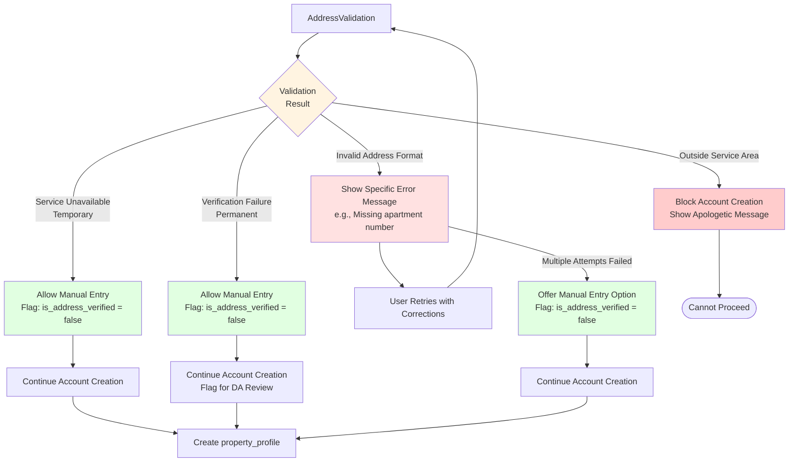
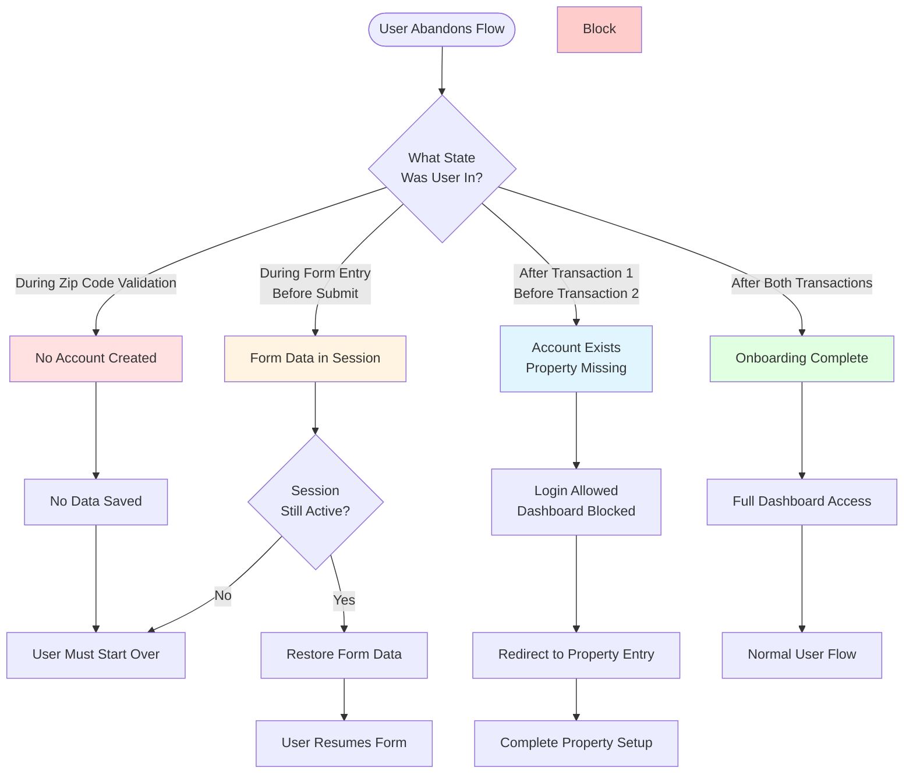
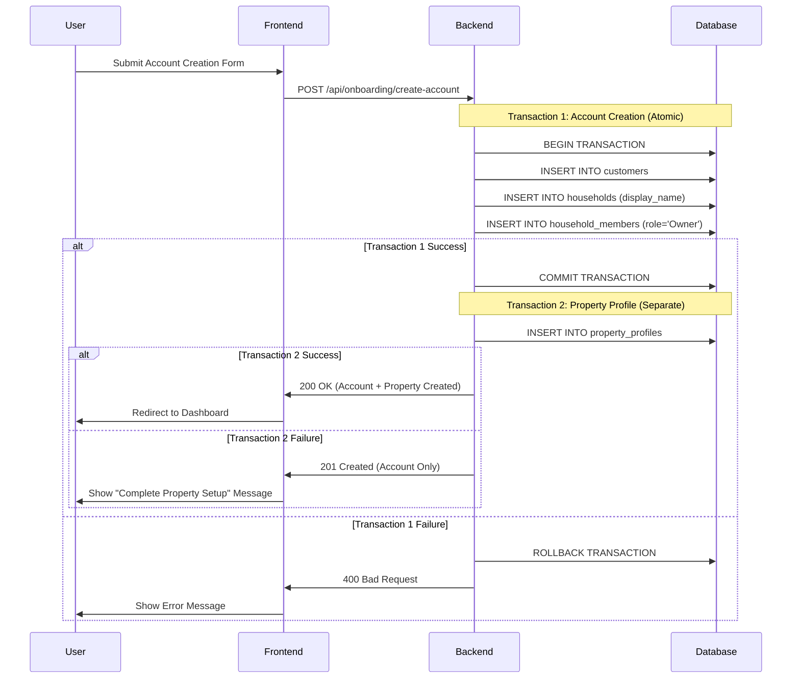

# Onboarding Flow Diagrams

**Date:** January 2025  
**Status:** Complete  
**Related Documents:**
- `onboarding-flow-detailed.md` (Detailed Onboarding Flow Sequence)
- PRD Part 2, Section 2.2 (High-Level Customer Journey Context)
- User Story Library - Epic: Secure User Onboarding & Access
- QA Analysis: Account Creation to Property Creation Flow

This document contains visual flow diagrams for the complete customer onboarding process from initial showcase browsing through account creation, property setup, and wizard initiation.

---

## Main Onboarding Flow

This diagram shows the complete flow from when a user first interacts with the platform through to starting the estimate wizard.

### Flow Steps Summary

1. **Zip Code Validation** - First gate to ensure serviceability
2. **Account Creation Form (Multi-Step)**
   - Step 2a: Authentication Method Selection
   - Step 2b: Account Information Entry
   - Step 2c: Property Address Entry (Required)
3. **Database Transactions**
   - Transaction 1: Account Creation (Atomic)
   - Transaction 2: Property Profile Creation (Separate)
4. **Dashboard Landing** - User sees options to begin Phase 2
5. **Wizard Initiation** - User chooses "Start From Scratch" or "Shop the Look"

---

## Error Handling Flow

This diagram details all error scenarios and how they are handled during address validation.

### Error Handling Rules

- **Service Unavailable (Temporary):** Allow manual entry, flag for later verification
- **Verification Failure (Permanent):** Allow manual entry, flag for Design Advisor review
- **Invalid Address Format:** Show specific error, allow retry, offer manual entry after multiple failures
- **Outside Service Area:** Block account creation, show apologetic message

---

## Abandonment Scenarios Flow

This diagram shows what happens when users abandon the onboarding flow at different stages.

### Abandonment Scenario Details

| Scenario | State | Behavior | Recovery |
|----------|-------|----------|----------|
| **During Zip Code Validation** | No account created | No data saved | User must start over |
| **During Form Entry (Before Submit)** | Form data in session | Session storage only | Restore if session active, otherwise restart |
| **After Transaction 1, Before Transaction 2** | Account exists, property missing | Login allowed, dashboard blocked | Redirect to property entry screen |
| **After Both Transactions** | Onboarding complete | Full access granted | Normal user flow |

---

## Database Transaction Flow

This sequence diagram shows the database transaction flow and error handling.

### Transaction Details

**Transaction 1: Account Creation (Atomic)**
- Creates `customer` record
- Creates `household` record with `display_name = '[User Full Name]'s Household'`
- Creates `household_members` record with `role='Owner'` and `status='Active'`
- **All-or-Nothing:** If any part fails, entire transaction is rolled back

**Transaction 2: Property Profile Creation (Separate)**
- Creates `property_profile` record with `household_id` and `street_address`
- **Separate Transaction:** Allows retry if address validation fails temporarily
- **Failure Handling:** Account exists but dashboard access is blocked until property profile is created

---

## Key Design Decisions

1. **Two Separate Transactions:** Transaction 1 and Transaction 2 are separate to allow graceful handling of temporary address validation failures while preserving account creation progress.

2. **Atomic Account Creation:** Transaction 1 is atomic to ensure data consistency - either the entire account setup succeeds or nothing is created.

3. **Dashboard Access Gating:** Dashboard access is blocked until both transactions complete successfully, ensuring users cannot proceed without a valid property profile.

4. **Error Recovery:** All error scenarios have specific recovery paths, with manual entry options for temporary service failures.

5. **Abandonment Handling:** System tracks user state and allows resumption from the appropriate point based on what was successfully completed.

---

## Related Documentation

- **Detailed Onboarding Flow:** `onboarding-flow-detailed.md` - Complete step-by-step sequence
- **PRD Part 2, Section 2.2:** High-Level Customer Journey Context
- **Data Model:** `customers`, `households`, `household_members`, `property_profiles` tables
- **User Stories:** See `onboarding-user-stories.md` for complete user story coverage
- **QA Analysis:** `comprehensive-mvp-documentation-analysis-2025.md` - Issue #19

