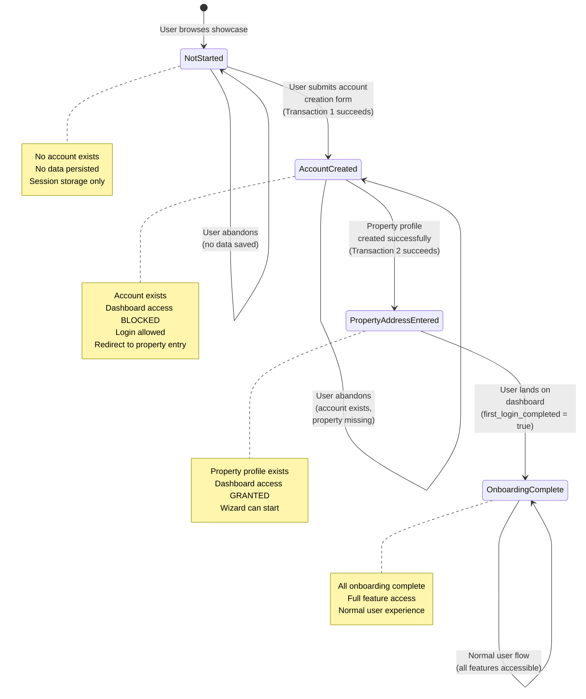

# Onboarding State Machine Documentation

**Date:** January 2025  
**Status:** Complete  
**Related Documents:**
- `onboarding-flow-detailed.md` (Detailed Onboarding Flow Sequence)
- PRD Part 2, Section 2.2 (High-Level Customer Journey Context)
- PRD Line 698 (Property Address Entry Blocking Rules)
- Data Model - `onboarding_state` JSONB Schema (Line 145-161)
- Onboarding Flow Diagrams (`onboarding-flow-diagrams.md`)
- Onboarding User Stories (`../qa/onboarding-user-stories.md`)

This document provides a formal state machine specification for the customer onboarding process, including states, transitions, blocking rules, and abandonment/resume logic.

---

## State Machine Overview

The onboarding process follows a strict state machine with four distinct states. Users progress through these states sequentially, and certain features are blocked until specific states are reached.

### States

1. **Not Started** - User hasn't begun onboarding (no account exists)
2. **Account Created** - Transaction 1 complete (customer + household + household_members exist)
3. **Property Address Entered** - Transaction 2 complete (property_profile exists)
4. **Onboarding Complete** - Both transactions complete, dashboard accessible

---

## State Machine Diagram



---

## State Definitions

### 1. Not Started

**Description:** User hasn't begun the onboarding process. No account or data exists in the system.

**Entry Conditions:**
- User browses public showcase
- User clicks primary CTA (Get Started, Get Your Estimate, Shop the Look)
- No customer record exists

**Exit Conditions:**
- User successfully submits account creation form
- Transaction 1 (Account Creation) completes successfully

**Data State:**
- No `customer` record
- No `household` record
- No `household_members` record
- No `property_profile` record
- Form data may exist in browser session storage (temporary)

**onboarding_state JSONB:** N/A (no customer record exists yet)

---

### 2. Account Created

**Description:** Transaction 1 has completed successfully. The customer account, household, and household_members records exist, but property_profile has not been created yet.

**Entry Conditions:**
- Transaction 1 (Account Creation) completes successfully
- `customer` record created
- `household` record created
- `household_members` record created (role='Owner', status='Active')
- Transaction 2 (Property Profile Creation) has not completed or failed

**Exit Conditions:**
- Transaction 2 (Property Profile Creation) completes successfully
- `property_profile` record created with `household_id` and `street_address`

**Data State:**
- `customer` record exists
- `household` record exists with `display_name = '[User Full Name]'s Household'`
- `household_members` record exists (role='Owner', status='Active')
- `property_profile` record does NOT exist
- `onboarding_state.property_address_entered = false`

**onboarding_state JSONB:**
```json
{
  "first_login_completed": false,
  "property_address_entered": false,
  "wizard_started": false,
  "wizard_completed": false,
  "product_tour_completed": false
}
```

---

### 3. Property Address Entered

**Description:** Transaction 2 has completed successfully. Both the account and property profile exist. Dashboard access is granted, but first login experience may still be pending.

**Entry Conditions:**
- Transaction 2 (Property Profile Creation) completes successfully
- `property_profile` record created with `household_id` and `street_address`
- `onboarding_state.property_address_entered = true`

**Exit Conditions:**
- User successfully logs in and lands on dashboard
- `onboarding_state.first_login_completed = true`

**Data State:**
- `customer` record exists
- `household` record exists
- `household_members` record exists
- `property_profile` record exists
- `onboarding_state.property_address_entered = true`
- `onboarding_state.first_login_completed = false` (until first login)

**onboarding_state JSONB:**
```json
{
  "first_login_completed": false,
  "property_address_entered": true,
  "wizard_started": false,
  "wizard_completed": false,
  "product_tour_completed": false
}
```

---

### 4. Onboarding Complete

**Description:** Both transactions complete and user has successfully logged in. Full dashboard access is granted and all features are available.

**Entry Conditions:**
- User successfully logs in after property profile creation
- `onboarding_state.first_login_completed = true`
- User lands on dashboard

**Exit Conditions:**
- N/A (terminal state for onboarding)
- User continues with normal application flow

**Data State:**
- `customer` record exists
- `household` record exists
- `household_members` record exists
- `property_profile` record exists
- `onboarding_state.first_login_completed = true`
- `onboarding_state.property_address_entered = true`

**onboarding_state JSONB:**
```json
{
  "first_login_completed": true,
  "property_address_entered": true,
  "wizard_started": false,  // May be true if user started wizard
  "wizard_completed": false,  // May be true if user completed wizard
  "product_tour_completed": false  // May be true if user completed/dismissed tour
}
```

---

## State Transitions

### Transition: Not Started → Account Created

**Trigger:** User submits account creation form

**Actions:**
1. Validate zip code (if not already validated)
2. Validate form data (authentication method, account info, property address)
3. Validate address via Google Maps API (or allow manual entry if service unavailable)
4. Check service area
5. Execute Transaction 1 (Atomic):
   - Create `customer` record
   - Create `household` record with `display_name = '[User Full Name]'s Household'`
   - Create `household_members` record (role='Owner', status='Active')
   - Initialize `onboarding_state` JSONB with all flags set to `false`
6. If Transaction 1 succeeds, proceed to Transaction 2
7. If Transaction 1 fails, rollback all changes, show error, remain in Not Started

**Conditions:**
- Zip code must be serviceable
- Address must be in service area (or manual entry allowed)
- All form validation must pass
- Transaction 1 must complete successfully

---

### Transition: Account Created → Property Address Entered

**Trigger:** Transaction 2 (Property Profile Creation) completes successfully

**Actions:**
1. Execute Transaction 2 (Separate from Transaction 1):
   - Create `property_profile` record with `household_id` and `street_address`
   - Set `onboarding_state.property_address_entered = true`
2. If Transaction 2 succeeds, transition to Property Address Entered
3. If Transaction 2 fails, remain in Account Created state

**Conditions:**
- Transaction 1 must have completed successfully (Account Created state)
- Address validation must pass (or manual entry allowed)
- Transaction 2 must complete successfully

**Error Handling:**
- If Transaction 2 fails temporarily (e.g., address validation service unavailable), account remains in Account Created state
- User can log in but dashboard access is blocked
- User is redirected to property entry screen to retry

---

### Transition: Property Address Entered → Onboarding Complete

**Trigger:** User successfully logs in and lands on dashboard

**Actions:**
1. User logs in with credentials
2. System checks `onboarding_state.property_address_entered === true`
3. System checks `onboarding_state.first_login_completed === false`
4. Grant dashboard access
5. Set `onboarding_state.first_login_completed = true`
6. Show dashboard with options: "Start From Scratch" or "Shop the Look"
7. Optionally show product tour prompt (if `product_tour_completed === false`)

**Conditions:**
- `onboarding_state.property_address_entered === true`
- User authentication succeeds
- Dashboard access is granted

---

## Blocking Rules by State

The following table defines what features and actions are blocked in each onboarding state:

| State | Login Access | Dashboard Access | Property Entry | Wizard Access | Other Features |
|-------|--------------|------------------|----------------|---------------|----------------|
| **Not Started** | ❌ Blocked | ❌ Blocked | ❌ Blocked | ❌ Blocked | ❌ All authenticated features blocked |
| **Account Created** | ✅ Allowed | ❌ **BLOCKED** | ✅ Redirected to property entry | ❌ Blocked | ❌ All dashboard features blocked |
| **Property Address Entered** | ✅ Allowed | ✅ **GRANTED** | ✅ Complete (first property done) | ✅ Can start | ✅ Full feature access |
| **Onboarding Complete** | ✅ Allowed | ✅ Allowed | ✅ Can add additional properties | ✅ Allowed | ✅ All features accessible |

### Detailed Blocking Rules

#### Not Started State

**Blocked:**
- All authenticated features
- Account creation form (until zip code validation passes)
- Dashboard access
- Property entry
- Wizard access

**Allowed:**
- Public showcase browsing
- Zip code validation
- Form data entry (stored in session only)

---

#### Account Created State

**Blocked:**
- **Dashboard Access** - User cannot access dashboard until property profile is created
- Wizard access
- Estimate creation
- All dashboard features

**Allowed:**
- Login (user can authenticate)
- Property address entry (user is redirected here)
- Retry property profile creation

**Redirect Logic:**
- If user tries to access dashboard: Redirect to property address entry screen
- Show message: "Please complete property setup to access your dashboard"
- User can retry property profile creation from this screen

**Reference:** PRD Line 698: "If a user tries to access the dashboard without a property profile, the system **MUST** redirect them to the property address entry screen."

---

#### Property Address Entered State

**Blocked:**
- None (all features accessible)

**Allowed:**
- Full dashboard access
- Wizard initiation ("Start From Scratch" or "Shop the Look")
- All application features
- Product tour (optional, can be dismissed)

**First Login Experience:**
- Dashboard shows prominent "Get Started" wizard prompt
- Optional product tour overlay (if `product_tour_completed === false`)
- User can explore dashboard or start wizard immediately

---

#### Onboarding Complete State

**Blocked:**
- None (all features accessible)

**Allowed:**
- All application features
- Wizard access
- Estimate creation
- Additional property creation (optional)
- All normal user workflows

---

## Abandonment and Resume Logic

### Abandonment Detection

The system detects abandonment when:
1. User closes browser/tab during onboarding
2. User navigates away from onboarding flow
3. Session expires during form entry
4. User doesn't complete a step within a reasonable time (no hard time limit, but session may expire)

### Abandonment Scenarios by State

#### 1. Abandonment in Not Started State

**Scenario:** User abandons during zip code validation or form entry (before submitting)

**State After Abandonment:**
- Remains in Not Started state
- No account created
- No data persisted to database

**Data Persistence:**
- Form data may exist in browser session storage (temporary)
- No database records created

**Resume Logic:**
- **If session still active:** Form data restored from session storage, user can continue
- **If session expired:** User must start over from beginning
- **No time limit:** Session expiration depends on server configuration (typically 30 minutes to 2 hours)

**Recovery:**
- User must restart onboarding flow from beginning
- Zip code validation required again
- Form data must be re-entered (unless session still active)

---

#### 2. Abandonment in Account Created State

**Scenario:** User abandons after Transaction 1 succeeds but before Transaction 2 completes

**State After Abandonment:**
- Remains in Account Created state
- Account exists in database
- Property profile does NOT exist
- `onboarding_state.property_address_entered = false`

**Data Persistence:**
- `customer` record exists
- `household` record exists
- `household_members` record exists
- `property_profile` record does NOT exist

**Resume Logic:**
- **User can log in:** Authentication succeeds because account exists
- **Dashboard access blocked:** System detects missing property profile
- **Automatic redirect:** User is redirected to property address entry screen
- **Message shown:** "Please complete property setup to access your dashboard"
- **No time limit:** User can complete property setup at any time

**Recovery:**
1. User logs in with credentials
2. System checks: `property_profile` exists? → No
3. System redirects to property address entry screen
4. User completes property address entry
5. Transaction 2 executes
6. State transitions to Property Address Entered
7. User gains dashboard access

**Reference:** See `onboarding-flow-diagrams.md` - Abandonment Scenarios Flow (Lines 157-160)

---

#### 3. Abandonment in Property Address Entered State

**Scenario:** User abandons after property profile creation but before first login

**State After Abandonment:**
- Remains in Property Address Entered state
- Account exists
- Property profile exists
- `onboarding_state.property_address_entered = true`
- `onboarding_state.first_login_completed = false`

**Data Persistence:**
- All database records exist
- Property profile created
- Dashboard access is granted (but user hasn't logged in yet)

**Resume Logic:**
- **User can log in:** Authentication succeeds
- **Dashboard access granted:** System checks `property_address_entered === true` → grants access
- **First login experience:** Product tour prompt shown (if applicable)
- **No time limit:** User can log in at any time

**Recovery:**
1. User logs in with credentials
2. System checks: `property_address_entered === true` → Yes
3. System grants dashboard access
4. System sets `first_login_completed = true`
5. State transitions to Onboarding Complete
6. User sees dashboard with wizard options

---

#### 4. Abandonment in Onboarding Complete State

**Scenario:** User completes onboarding but doesn't start wizard immediately

**State After Abandonment:**
- Remains in Onboarding Complete state
- All onboarding complete
- User can return anytime

**Data Persistence:**
- All database records exist
- `onboarding_state.first_login_completed = true`
- `onboarding_state.property_address_entered = true`

**Resume Logic:**
- **Normal login:** User logs in and sees dashboard
- **Wizard available:** User can start wizard anytime
- **No special handling:** Normal user flow

**Recovery:**
- No special recovery needed
- User simply logs in and continues normal workflow

---

## Session Persistence Rules

### Form Data Persistence (Not Started State)

**Storage:** Browser session storage (client-side only)

**Lifetime:**
- Persists until browser session ends
- Cleared when user closes browser/tab
- Cleared when session expires (server-side session timeout)

**What's Stored:**
- Zip code (if validated)
- Form field values (authentication method, name, email, address input)
- Current form step

**Recovery:**
- If session active: Form data restored automatically
- If session expired: User must re-enter all data

---

### Account Persistence (Account Created State)

**Storage:** Database (persistent)

**Lifetime:** Permanent (until account deleted)

**What's Stored:**
- `customer` record
- `household` record
- `household_members` record
- `onboarding_state` JSONB (all flags `false` except as updated)

**Recovery:**
- User can log in anytime
- System redirects to property entry if property profile missing
- No data loss

---

### Property Profile Persistence (Property Address Entered State)

**Storage:** Database (persistent)

**Lifetime:** Permanent (until property deleted)

**What's Stored:**
- `property_profile` record
- `onboarding_state.property_address_entered = true`

**Recovery:**
- User can log in anytime
- Dashboard access granted immediately
- No additional steps required

---

## Redirect Logic

### Redirect Rules by State

| Current State | User Action | Redirect Target | Condition |
|---------------|-------------|-----------------|-----------|
| **Not Started** | Tries to access dashboard | Account creation form | No account exists |
| **Account Created** | Tries to access dashboard | Property address entry screen | Property profile missing |
| **Account Created** | Logs in successfully | Property address entry screen | Property profile missing |
| **Property Address Entered** | Logs in successfully | Dashboard | Property profile exists |
| **Onboarding Complete** | Logs in successfully | Dashboard | Normal flow |

### Redirect Implementation

**Check on Login:**
```javascript
// Pseudo-code
if (!customer.exists) {
  redirect('/onboarding/account-creation');
} else if (!property_profile.exists) {
  redirect('/onboarding/property-entry');
} else if (!onboarding_state.first_login_completed) {
  redirect('/dashboard'); // First login experience
} else {
  redirect('/dashboard'); // Normal login
}
```

**Check on Dashboard Access:**
```javascript
// Pseudo-code
if (!property_profile.exists) {
  redirect('/onboarding/property-entry');
  showMessage('Please complete property setup to access your dashboard');
}
```

---

## Integration with onboarding_state JSONB Schema

### Schema Mapping

The state machine states map to the `onboarding_state` JSONB flags as follows:

| State Machine State | onboarding_state Flags | Database Check |
|---------------------|------------------------|----------------|
| **Not Started** | N/A (no customer record) | `customer` record does NOT exist |
| **Account Created** | `property_address_entered: false` | `customer` exists AND `property_profile` does NOT exist |
| **Property Address Entered** | `property_address_entered: true` AND `first_login_completed: false` | `property_profile` exists AND `first_login_completed === false` |
| **Onboarding Complete** | `property_address_entered: true` AND `first_login_completed: true` | Both flags are `true` |

### State Detection Logic

**Determine Current State:**
```javascript
// Pseudo-code
function getOnboardingState(customer) {
  if (!customer.exists) {
    return 'Not Started';
  }
  
  const onboardingState = customer.onboarding_state;
  const propertyProfile = getPropertyProfile(customer.household_id);
  
  if (!propertyProfile.exists) {
    return 'Account Created';
  }
  
  if (onboardingState.property_address_entered && !onboardingState.first_login_completed) {
    return 'Property Address Entered';
  }
  
  if (onboardingState.property_address_entered && onboardingState.first_login_completed) {
    return 'Onboarding Complete';
  }
  
  // Fallback (should not happen)
  return 'Account Created';
}
```

### Flag Updates During Transitions

**Transition: Not Started → Account Created**
- Initialize all flags to `false`
- No flags set to `true` yet

**Transition: Account Created → Property Address Entered**
- Set `onboarding_state.property_address_entered = true`

**Transition: Property Address Entered → Onboarding Complete**
- Set `onboarding_state.first_login_completed = true`

**Additional Flags (set during normal flow, not state transitions):**
- `wizard_started`: Set when user begins wizard
- `wizard_completed`: Set when user completes wizard
- `product_tour_completed`: Set when user completes/dismisses tour

---

## Error Scenarios

### Transaction 1 Failure (Account Creation)

**State:** Remains in Not Started

**Actions:**
- Rollback all database changes
- Show error message to user
- Allow user to retry
- Form data may be preserved in session

**Recovery:**
- User can correct errors and resubmit
- No account created, so user must start over

---

### Transaction 2 Failure (Property Profile Creation)

**State:** Remains in Account Created

**Actions:**
- Account exists (Transaction 1 succeeded)
- Property profile not created
- User can log in but dashboard access blocked
- Redirect to property entry screen

**Recovery:**
- User logs in
- System redirects to property entry screen
- User can retry property profile creation
- No data loss (account preserved)

**Error Types:**
- **Temporary (Service Unavailable):** Allow manual entry, flag for later verification
- **Permanent (Outside Service Area):** Block account creation (should not reach this state if zip code validation worked)
- **Database Error:** Show error, allow retry

---

## Time Limits

**No Hard Time Limits:**
- The system does not enforce hard time limits for completing onboarding
- Users can complete onboarding at their own pace

**Session Expiration:**
- Browser session may expire (typically 30 minutes to 2 hours, server-dependent)
- If session expires during form entry (Not Started state), user must restart
- If account is created (Account Created or later states), user can always log in and resume

**Recommendation:**
- Consider adding a "Save Progress" feature for form entry (Not Started state)
- Consider email reminders for users in Account Created state who haven't completed property setup after 24-48 hours

---

## Related Documentation

- **Detailed Onboarding Flow:** `onboarding-flow-detailed.md` - Complete step-by-step sequence
- **PRD Part 2, Section 2.2:** High-Level Customer Journey Context
- **PRD Line 698:** Property Address Entry Blocking Rules
- **Data Model Lines 145-161:** `onboarding_state` JSONB Schema Definition
- **Onboarding Flow Diagrams:** `onboarding-flow-diagrams.md` - Visual flow diagrams
- **Onboarding User Stories:** `../qa/onboarding-user-stories.md` - Complete user story coverage
- **Decision History:** `../decisions-and-resolutions.md` Issue #4 - Original issue this document resolves

---

## Summary

This state machine provides a complete specification for the onboarding process:

1. **Four distinct states** with clear entry/exit conditions
2. **Blocking rules** that prevent dashboard access until property profile is created
3. **Abandonment handling** that allows users to resume from any state
4. **Integration** with the `onboarding_state` JSONB schema for state detection
5. **Redirect logic** that guides users to complete onboarding

The state machine ensures data consistency, provides clear user experience, and handles all edge cases including abandonment and error scenarios.

